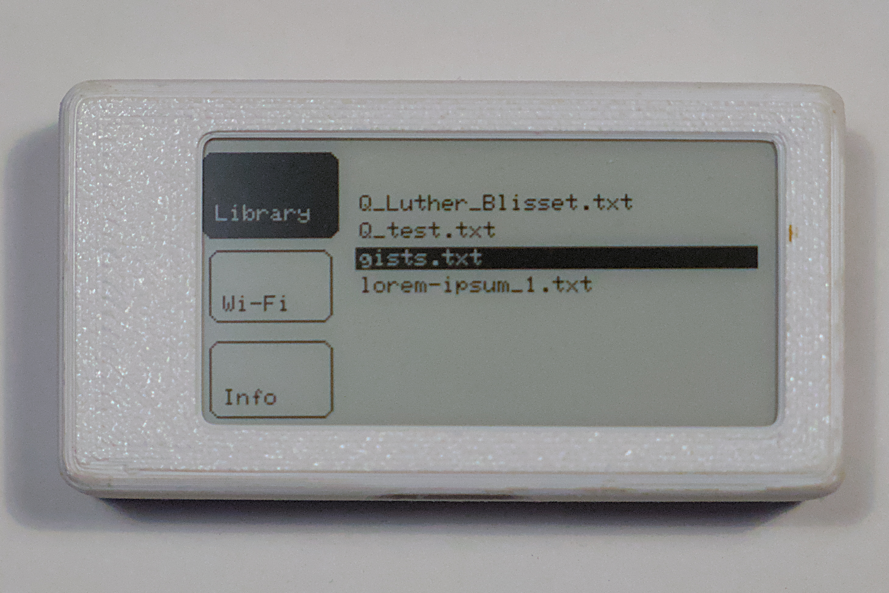
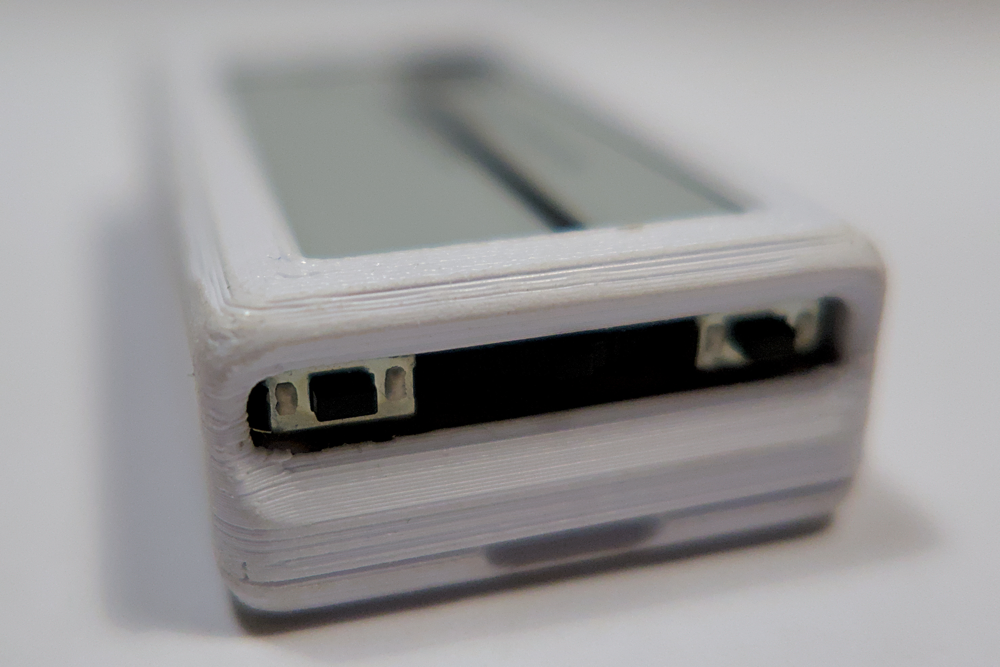
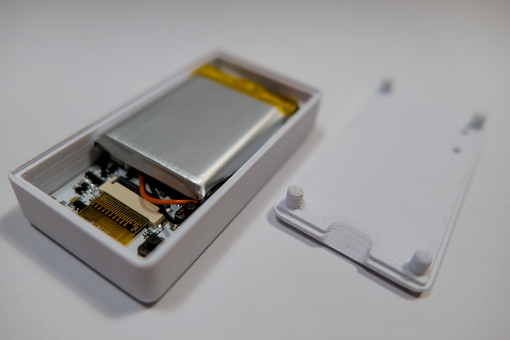

<a id="readme-top"></a>


<!-- PROJECT SHIELDS -->
[![Contributors][contributors-shield]][contributors-url]
[![Forks][forks-shield]][forks-url]
[![Stargazers][stars-shield]][stars-url]
[![Issues][issues-shield]][issues-url]
[![project_license][license-shield]][license-url]
[![Build][workflow-shield]][workflow-url]


<!-- PROJECT LOGO -->
<div align="center">
    <a href="https://github.com/SamueleFacenda/tiny-reader">
        
    </a>
    <h3 align="center">TinyReader</h3>
    <p align="center">
        TinyReader is a small and easy to assembly e-book reader. 
        <br />
        It is intended for mobile reading, it's highly pocketable and supports wireless ebooks transfer. 
        <br />
        <a href="https://github.com/SamueleFacenda/tiny-reader"><strong>Explore the docs »</strong></a>
        <br />
        <br />
        <a href="#gallery">View Pictures</a>
        &middot;
        <a href="https://github.com/SamueleFacenda/tiny-reader/issues">Report Bug</a>
        &middot;
        <a href="https://github.com/SamueleFacenda/tiny-reader/issues">Request Feature</a>
    </p>
</div>


<!-- TABLE OF CONTENTS -->
<details>
    <summary>Table of Contents</summary>
    <ol>
        <li>
            <a href="#about-the-project">About The Project</a>
            <ul>
                <li><a href="#built-with">Built With</a></li>
            </ul>
        </li>
        <li>
            <a href="#getting-started">Getting Started</a>
            <ul>
                <li><a href="#prerequisites">Prerequisites</a></li>
                <li><a href="#installation">Installation</a></li>
            </ul>
        </li>
        <li><a href="#docs">Docs</a></li>
        <li><a href="#usage">Usage</a></li>
        <li><a href="#roadmap">Roadmap</a></li>
        <li><a href="#contributing">Contributing</a></li>
        <li><a href="#license">License</a></li>
        <li><a href="#contact">Contact</a></li>
        <li><a href="#acknowledgments">Acknowledgments</a></li>
        <li><a href="#star-history">Star History</a></li>
        <li><a href="#gallery">Gallery</a></li>
    </ol>
</details>


<!-- ABOUT THE PROJECT -->
## About The Project

<div style="width:40%; margin: auto;">


</div>

TinyReader is a small and easy to assembly e-book reader. It is intended for mobile reading, it's 
highly pocketable and supports wireless ebooks transfer. 

The project is experimental and practical rather than polished. Mechanical fit, battery choice, and power behavior depend on the exact hardware configuration and enclosure you build around it.

Features:
- low battery usage thanks to e-ink display and automatic deep sleep
- custom font with latin-1 encoding support
- fast page turning thanks to partial refreshes
- high readability: the font is actually bigger than a normal book font,
combined with a small display which requires minimal eye movement it results
in an high read comfort.

<p align="right">(<a href="#readme-top">back to top</a>)</p>


### Built With

* Arduino CLI
* ESP32 platform support through Nix
* LittleFS
* GxEPD2
* Adafruit GFX Library
* ArduinoJson
* OpenSCAD for enclosure work

### Hardware and cost

TinyReader primary goals were to build a pocketable and cheap ebooks reader.
The total cost is lower than 30€ (20€ without expeditions), the components used are:
- [CrowPanel ESP32 2.13 display board](https://www.elecrow.com/crowpanel-esp32-2-13-e-paper-hmi-display-with-122-250-resolution-black-white-color-driven-by-spi-interface.html): 11.9$
- A 700/800mAh LiPo battery (602060 or 603040): <10€
- 3d printed enclosure: <0.1€

<p align="right">(<a href="#readme-top">back to top</a>)</p>


<!-- GETTING STARTED -->
## Getting Started

The repository includes a Nix flake, so the Arduino toolchain and project dependencies can be gathered with `nix develop`.

The scad source is available here or the rendered stl can be downloaded [directly from printables](https://www.printables.com/model/1741918-tinyreader-case-elecrow-crowpanel-esp32-213).

### Prerequisites

* Nix with flakes enabled
* The CrowPanel ESP32 2.13 E-Paper HMI display board
* A suitable LiPo battery

### Installation

1. Clone the repo
     ```sh
     git clone https://github.com/SamueleFacenda/tiny-reader.git
     ```
2. Enter the development shell
     ```sh
     nix develop
     ```
3. Compile the sketch with Arduino CLI
     ```sh
     arduino-cli compile --fqbn esp32:esp32:esp32
     ```
4. Flash the firmware to the board (port may vary)
    ```sh
    arduino-cli upload -p /dev/ttyUSB0 --fqbn esp32:esp32:esp32s3 --verbose 
    ```

The flake provides the Arduino CLI, ESP32 board packages, Python serial support, and OpenSCAD.

### Assembly

No tool is actually required for the device assembly. Some more work might be required depending on
the battery size.

The board features a non so common SH1.0-2Pin battery socket so an adaptor might be necessary.

If you are using a 603040 battery you might want to remove the UART and GPIO ports to reduce the
device height. For 602060 batteries it's not necessary, they fit between the ports (but have smaller
capacity)

<p align="right">(<a href="#readme-top">back to top</a>)</p>


## Docs

* [tiny-reader.ino](tiny-reader.ino) is the Arduino entrypoint. It wires the display, input, storage, and Wi-Fi flow together.
* [tiny_reader_2-13_case.scad](tiny_reader_2-13_case.scad) is the OpenSCAD enclosure model. You can find the rendered version
[here on pritables](https://www.printables.com/model/1741918-tinyreader-case-elecrow-crowpanel-esp32-213).
* The OpenSCAD model references a CrowPanel board STL for fit checking and conversion. The board asset can be converted from the vendor archive at [00-2-13_view_asm.rar](https://github.com/Elecrow-RD/CrowPanel-ESP32-2.13-E-paper-HMI-Display-with-122-250/blob/ca6f62e88c83c108be3904d36e00ded4f55bb68f/3D%20file/00-2-13_view_asm.rar).
* The firware is built with customization in mind, take a look at [the config file](src/Config.h) for
all the available customization options (other boards might be supported as well).


<!-- USAGE EXAMPLES -->
## Usage

1. Flash the sketch to the board.
2. Store plain text books on the device or upload them through the Wi-Fi page.
3. Use the physical buttons to navigate the library, reading view, and status screens.
4. Let the device enter deep sleep when idle to preserve battery life.
5. Wake from the deep sleep using the `home` button.

See the source files for the screen flow and button mapping.

<p align="right">(<a href="#readme-top">back to top</a>)</p>


<!-- ROADMAP -->
## Roadmap

- Improve the library and book navigation flow.
- Refine the Wi-Fi user interface.
- Add a dedicated sleep-screen experience.
- Improve battery status reporting when a usable ADC input is available.
- Update only the necessary parts of the screen during Wi-Fi uptime refreshes.
- Evaluate compressed book storage to reduce flash usage.
- Reduce friction in navigation and return paths between screens.
- Investigate ghosting problems in sunlight.

See the [open issues](https://github.com/SamueleFacenda/tiny-reader/issues) for the current list of planned work.

<p align="right">(<a href="#readme-top">back to top</a>)</p>


<!-- CONTRIBUTING -->
## Contributing

Contributions are welcome. If you have an idea that would make TinyReader better, open an issue or submit a pull request with a clear description of the change.

1. Fork the Project
2. Create your Feature Branch (`git checkout -b feature/AmazingFeature`)
3. Commit your Changes (`git commit -m 'Add some AmazingFeature'`)
4. Push to the Branch (`git push origin feature/AmazingFeature`)
5. Open a Pull Request

<p align="right">(<a href="#readme-top">back to top</a>)</p>


<!-- LICENSE -->
## License

Distributed under the EUPL. See [LICENSE.md](LICENSE.md) for more information.

<p align="right">(<a href="#readme-top">back to top</a>)</p>


<!-- CONTACT -->
## Contact

Project Link: [https://github.com/SamueleFacenda/tiny-reader](https://github.com/SamueleFacenda/tiny-reader)

Use GitHub issues for bugs, feature requests, and build questions.

<p align="right">(<a href="#readme-top">back to top</a>)</p>


<!-- ACKNOWLEDGMENTS -->
## Acknowledgments

* [Original case designer](https://www.printables.com/model/1566902-case-for-crowpanel-213-epaper)
* [CrowPanel ESP32 2.13 E-Paper HMI display](https://example.com/tinyreader-crowpanel-esp32-2-13)
* [Nix](https://nixos.org/)
* [Arduino CLI](https://arduino.github.io/arduino-cli/latest/)

<p align="right">(<a href="#readme-top">back to top</a>)</p>


<!-- GALLERY -->
## Gallery

### TinyReader buttons interface


### TinyReader internal design



## Star History

[](https://www.star-history.com/#SamueleFacenda/tiny-reader&Date)


<!-- MARKDOWN LINKS & IMAGES -->
[contributors-shield]: https://img.shields.io/github/contributors/SamueleFacenda/tiny-reader.svg?style=for-the-badge
[contributors-url]: https://github.com/SamueleFacenda/tiny-reader/graphs/contributors
[forks-shield]: https://img.shields.io/github/forks/SamueleFacenda/tiny-reader.svg?style=for-the-badge
[forks-url]: https://github.com/SamueleFacenda/tiny-reader/network/members
[stars-shield]: https://img.shields.io/github/stars/SamueleFacenda/tiny-reader.svg?style=for-the-badge
[stars-url]: https://github.com/SamueleFacenda/tiny-reader/stargazers
[issues-shield]: https://img.shields.io/github/issues/SamueleFacenda/tiny-reader.svg?style=for-the-badge
[issues-url]: https://github.com/SamueleFacenda/tiny-reader/issues
[license-shield]: https://img.shields.io/github/license/SamueleFacenda/tiny-reader.svg?style=for-the-badge
[license-url]: https://github.com/SamueleFacenda/tiny-reader/blob/main/LICENSE.md
[workflow-shield]: https://img.shields.io/github/actions/workflow/status/SamueleFacenda/tiny-reader/main.yml?style=for-the-badge
[workflow-url]: https://github.com/SamueleFacenda/tiny-reader/actions/workflows/main.yml
